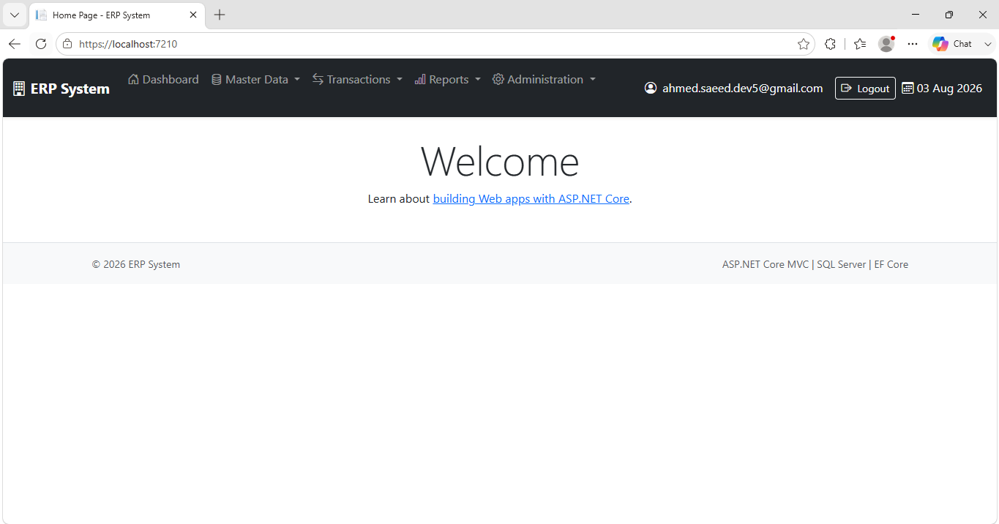
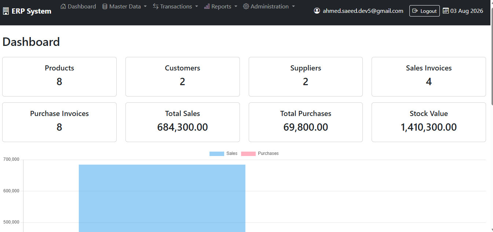
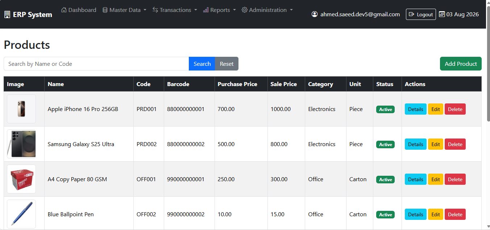
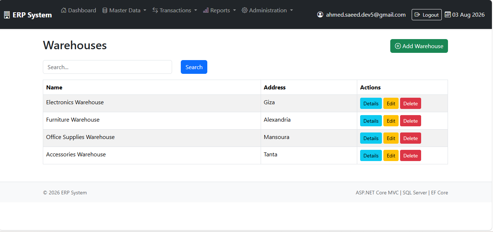

<h1 align="center">📦 ERP Inventory Management System</h1>

<p align="center">
A professional <b>ERP Inventory Management System</b> built with <b>ASP.NET Core MVC</b>, designed to manage products, inventory, warehouses, purchasing, and sales operations with secure authentication and role-based authorization.
</p>

<p align="center">
  
  
  
  
  
  
</p>

---

# 🚀 Overview

ERP Inventory Management System is an enterprise-style web application developed using ASP.NET Core MVC.

The system helps businesses manage products, inventory, warehouses, suppliers, customers, purchasing, and sales through a secure and user-friendly interface.

The project follows modern software engineering practices using Repository Pattern, Unit of Work, and Entity Framework Core.

---

# ✨ Features

## 🔐 Authentication & Authorization

- ASP.NET Identity
- Secure Login & Logout
- Role-Based Authorization
- Admin Role
- User Role

---

## 📦 Product Management

- Create, Edit, Delete Products
- Product Images Upload
- Barcode Support
- Product Search
- Category Assignment
- Unit Assignment

---

## 🗂 Category Management

- CRUD Operations
- Image Upload
- Search
- Validation

---

## 📏 Unit Management

- Create, Update and Delete Units
- Product Unit Assignment

---

## 🏬 Warehouse Management

- Warehouse CRUD Operations
- Inventory Tracking by Warehouse

---

## 📊 Inventory Management

- Stock In
- Stock Out
- Warehouse Transfers
- Automatic Quantity Updates

---

## 🚚 Supplier Management

- Supplier CRUD
- Purchase Invoice Support

---

## 👥 Customer Management

- Customer CRUD
- Sales Invoice Support

---

## 🛒 Purchase Management

- Purchase Invoice
- Purchase Details
- Automatic Stock Increase

---

## 💰 Sales Management

- Sales Invoice
- Sales Details
- Automatic Stock Deduction

---

## 📈 Dashboard

- Products Statistics
- Categories Statistics
- Warehouses Statistics
- Suppliers Statistics
- Customers Statistics
- Inventory Overview

---

## 🔍 Search & Validation

- Search
- Server-side Validation
- Client-side Validation
- Success & Error Notifications

---

## 📄 Reports

- PDF Export
- Excel Export

---

# 🛠 Technologies Used

### Backend

- ASP.NET Core MVC
- C#
- Entity Framework Core
- SQL Server
- ASP.NET Identity
- LINQ

### Frontend

- Razor Views
- Bootstrap 5
- HTML5
- CSS3
- JavaScript
- jQuery

---

# 🏗 Architecture

The project follows a layered architecture using:

- Repository Pattern
- Unit of Work Pattern
- Dependency Injection
- Entity Framework Core
- Code First
- EF Core Migrations

### Design Principles

- SOLID Principles
- Separation of Concerns
- Clean Code
- Maintainable Architecture

---

# 👥 Roles

## 👨‍💼 Admin

- Full System Access
- Manage Products
- Manage Categories
- Manage Units
- Manage Warehouses
- Manage Suppliers
- Manage Customers
- Manage Inventory
- Manage Purchase Invoices
- Manage Sales Invoices
- Manage Users

---

## 👤 User

- Login to the System
- Access Authorized Pages
- Perform Allowed Operations

---

# 📸 Screenshots

> Add screenshots here.

### Login



### Dashboard



### Products



### Warehouses



### Purchase Invoice


### Sales Invoice


---

# ⚙️ Installation

Clone the repository

```bash
git clone https://github.com/ahmedsaeeddev5-alt/ERP-Inventory-System-ASP.NET-Core-MVC.git
```

Move to project folder

```bash
cd ERP-Inventory-System-ASP.NET-Core-MVC
```

Restore packages

```bash
dotnet restore
```

Apply migrations

```bash
dotnet ef database update
```

Run the project

```bash
dotnet run
```

---

# 🗄 Database

- SQL Server
- Entity Framework Core
- Code First Approach
- EF Core Migrations

---

# 🎯 What This Project Demonstrates

- Enterprise ASP.NET Core MVC Development
- Repository Pattern
- Unit of Work Pattern
- Authentication & Authorization
- Entity Framework Core
- SQL Server
- Inventory Management
- Purchasing Workflow
- Sales Workflow
- Responsive UI Development

---

# 📌 Future Enhancements

- Email Notifications
- Charts & Analytics
- REST API
- Docker Support
- Azure Deployment
- Audit Logs

---

# 👨‍💻 Developer

**Ahmed Saeed Reiyd**

- Junior Full Stack .NET Developer
- ASP.NET Core MVC
- ASP.NET Core Web API
- SQL Server
- Entity Framework Core

---

<p align="center">
⭐ If you like this project, don't forget to give it a star.
</p>
